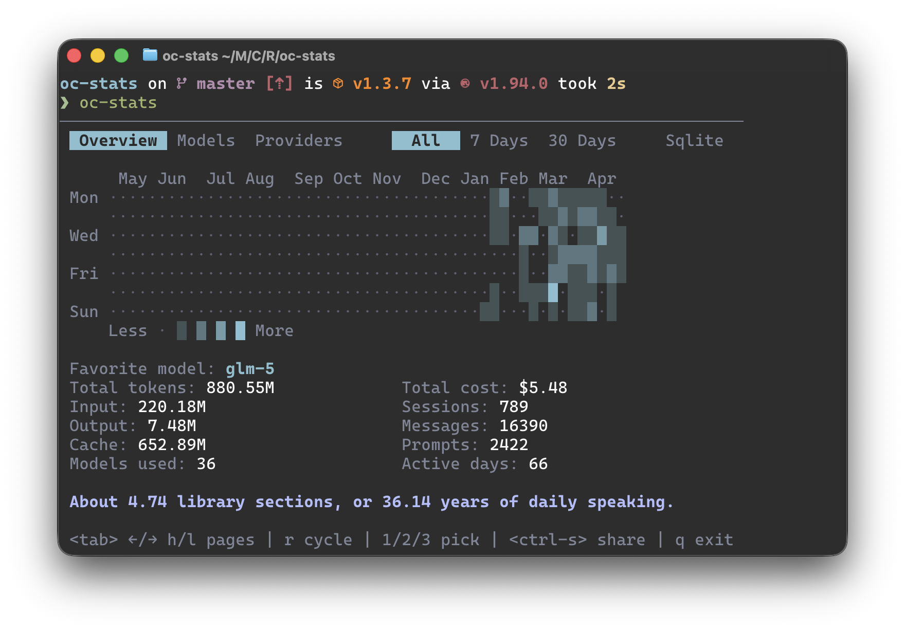
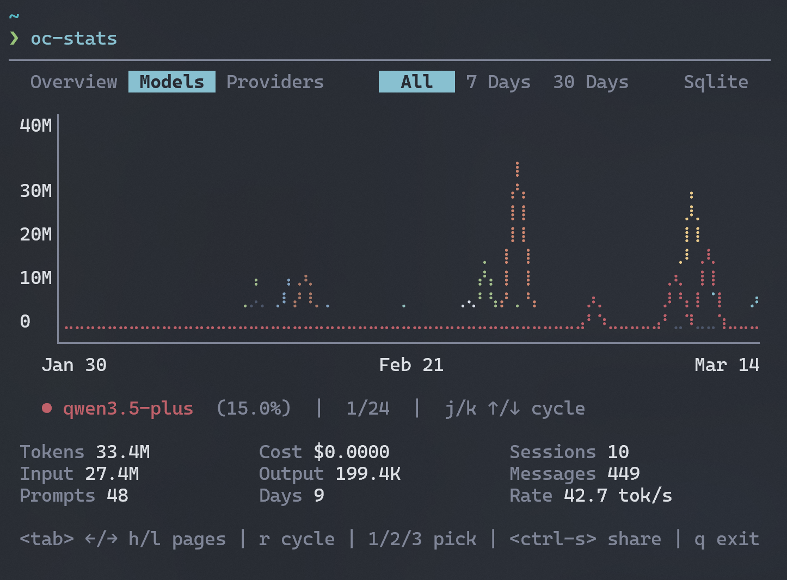
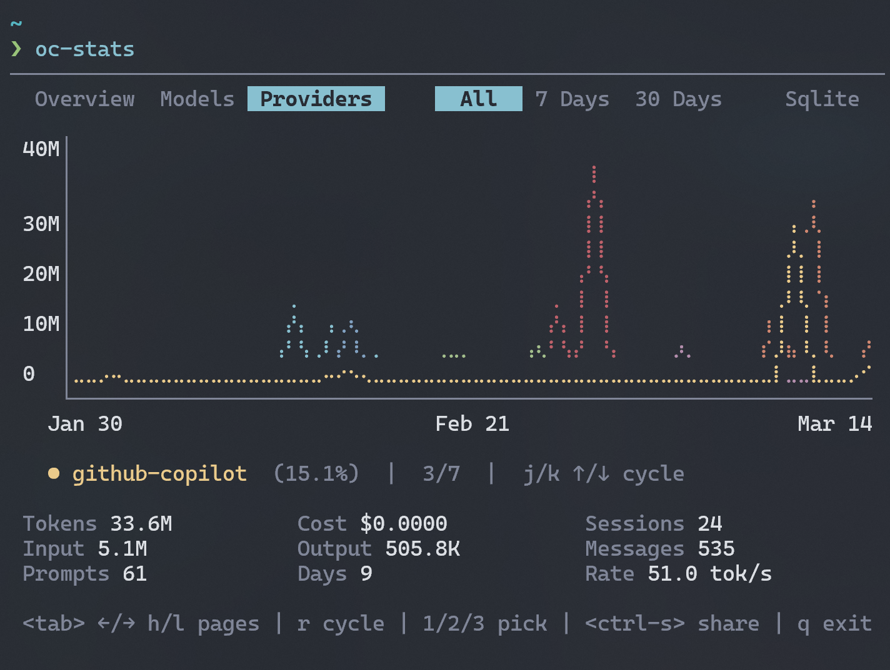
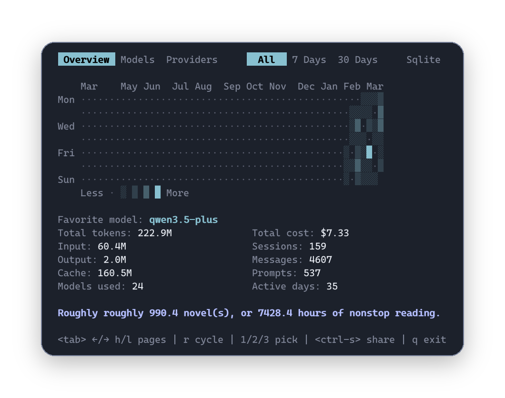

<h1 align="center">OpenCode Stats</h1>

<p align="center">
  <a href="https://ratatui.rs/"></a>
</p>

<p align="center">
  <a href="./README.md">English</a> | 
  <a href="./README_CN.md">中文</a>
</p>

A terminal dashboard for OpenCode usage statistics.



`oc-stats` reads your local OpenCode SQLite database or JSON export files and displays token usage, cost estimates, model and provider distributions, and a 365-day activity heatmap directly in your terminal. Inspired by Claude Code's `/stats` command, this is an independent implementation focused on local execution, export, and shareability.

> If you're already using OpenCode and want a quick view of your usage, costs, and activity trends, this tool is ready to go.
>
> This is an unofficial community project and is not affiliated with, endorsed by, or maintained by the OpenCode team.

## Features

- Terminal dashboard UI built on `ratatui`
- Automatically reads OpenCode local database, or loads export files via `--json`
- Displays total tokens, costs, session count, message count, prompt count, and other overview metrics
- View usage breakdown by model and provider
- Supports three time ranges: all time, last 7 days, and last 30 days
- Built-in 365-day activity heatmap for observing long-term usage trends
- Supports dark / light theme via command-line argument
- Copy current view to clipboard: prioritize image export (share card), with automatic fallback to text summary
- Local model pricing cache with update / clean commands
- Output data calculation aligns with `opencode stats` and `opencode stats --models` for consistency

## Preview

OpenCode Stats provides three data perspectives:

| Year view                                                     | Model usage                                                 | Provider usage                                                    |
| ------------------------------------------------------------- | ----------------------------------------------------------- | ----------------------------------------------------------------- |
|  |  |  |

Each page also supports exporting a transparent-background share card directly to clipboard:



## Installation

### Install from crates.io

```bash
cargo install opencode-stats
```

After installation, run:

```bash
oc-stats
```

### Download pre-built binaries from GitHub Releases

Download the archive for your platform from the Releases page, extract it, and run `oc-stats` directly.

The current release workflow builds for:

- Windows `x86_64-pc-windows-msvc`
- macOS `x86_64-apple-darwin`
- macOS `aarch64-apple-darwin`
- Linux `x86_64-unknown-linux-gnu`
- Linux `x86_64-unknown-linux-musl`

### Build from source

```bash
git clone https://github.com/Cateds/opencode-stats.git
cd opencode-stats
cargo build --release
```

The compiled binary will be located at:

```bash
target/release/oc-stats
```

Or build directly using the git path:

```bash
cargo install --git https://github.com/Cateds/opencode-stats.git
```

## Usage

### Default launch

By default, the program automatically locates your OpenCode local database and loads the data:

```bash
oc-stats
```

### Specify database path

```bash
oc-stats --db /path/to/opencode.db
```

### Specify JSON export file

```bash
oc-stats --json /path/to/export.json
```

### Specify theme

```bash
oc-stats --theme auto
oc-stats --theme dark
oc-stats --theme light
```

### Ignore placeholder zero-cost values

By default, `oc-stats` keeps stored costs as-is, including `cost: 0`, to preserve compatibility with existing behavior. If your OpenCode setup stores `cost: 0` as a placeholder for responses that still have token usage, use `--ignore-zero` to treat those zero values as missing and estimate the cost instead.

```bash
oc-stats --ignore-zero
```

### Cache management commands

View the local pricing cache path:

```bash
oc-stats cache path
```

Update the local pricing cache:

```bash
oc-stats cache update
```

Clean the local pricing cache:

```bash
oc-stats cache clean
```

## Interaction

Once the program is running, you can quickly navigate pages and time ranges using the keyboard:

- `Tab` / `Left` / `Right` / `h` / `l` — Switch pages
- `Up` / `Down` / `j` / `k` — Move focus within `Models` / `Providers` pages
- `r` — Cycle through time ranges
- `1` / `2` / `3` — Quickly switch time ranges
- `Ctrl+S` — Copy current view to clipboard
- `q` / `Esc` / `Ctrl+C` — Exit the program

Pages:

- `Overview` — Overall usage summary
- `Models` — Usage statistics by model
- `Providers` — Usage statistics by provider

Time ranges:

- `All time`
- `Last 7 days`
- `Last 30 days`

## Data sources and pricing

### Data input

`oc-stats` supports two input sources:

- OpenCode local SQLite database
- OpenCode exported JSON files

Default database locations:

- Windows: `%APPDATA%/opencode/opencode.db`
- Linux: `~/.local/share/opencode/opencode.db`
- macOS: `~/Library/Application Support/opencode/opencode.db`

### Pricing data

Model pricing is read from local cache first and refreshed from remote when needed:

- Local cache path: `~/.cache/oc-stats/models.json`
- Remote source: `https://models.dev/api.json`
- Cache TTL: 1 hour

If local overrides exist in your OpenCode configuration, they take precedence.

When complete pricing information is unavailable, the program falls back to estimated cache read/write costs. If the database already contains actual costs, those values are prioritized.

If the database stores `cost: 0` for a nonzero-token response, `oc-stats` keeps that stored zero by default. Pass `--ignore-zero` to estimate the cost instead.

## Use cases

- Quickly view your OpenCode token consumption
- Analyze usage preferences by model or provider
- Understand recent and long-term usage trends
- Export statistics as images or text for easy sharing

## License

MIT

## Acknowledgments

- Font: [Cascadia Code](https://github.com/microsoft/cascadia-code), under SIL Open Font License
- Experience inspired by Claude Code's `/stats` command
- Reference project: [ocmonitor-share](https://github.com/Shlomob/ocmonitor-share)
