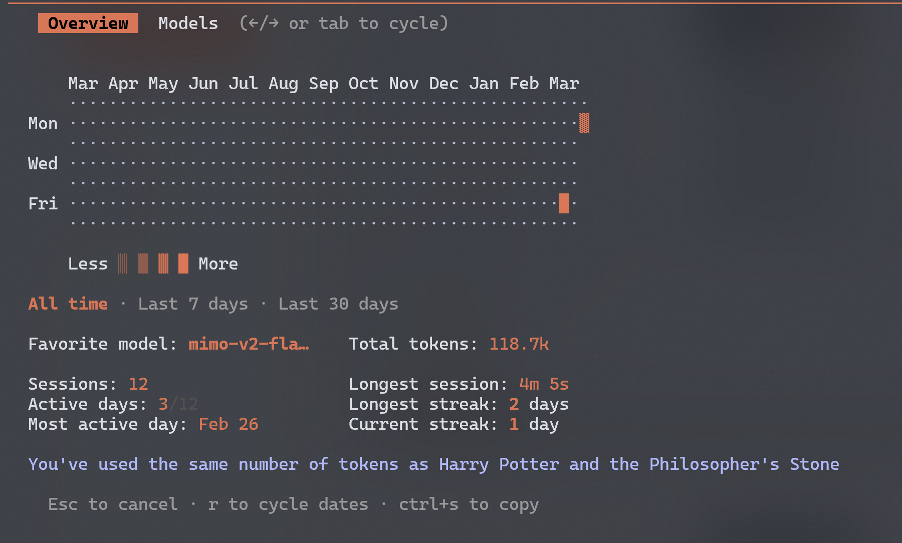
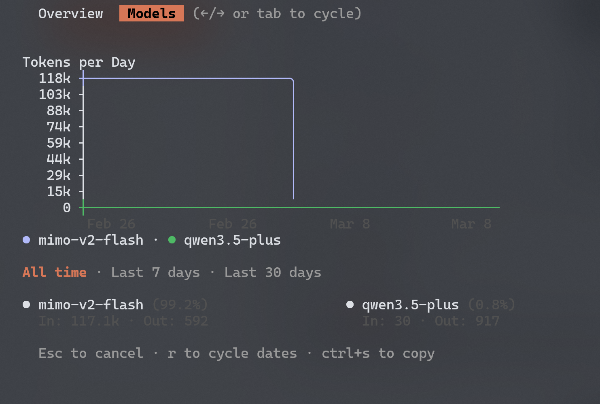

# Opencode Status CLI 实现规划

## 项目概述

实现一个类似 Claude status 的 CLI 程序，使用 Ratatui 的 inline viewport 功能，在终端行内渲染热力图和折线图，无需 alt screen。

## 技术选型

| 组件     | 技术选择              | 说明                        |
| -------- | --------------------- | --------------------------- |
| TUI 框架 | `ratatui`             | 使用 inline viewport 模式   |
| 终端后端 | `crossterm`           | 跨平台终端控制              |
| 数据库   | `rusqlite`            | 读取 opencode SQLite 数据库 |
| 时间处理 | `chrono`              | 日期时间计算                |
| 数据处理 | `serde`, `serde_json` | JSON 序列化                 |
| 错误处理 | `anyhow`, `thiserror` | 错误管理                    |

## 项目结构

```text
oc-status/
├── Cargo.toml
├── src/
│   ├── main.rs              # 入口和 CLI 命令
│   ├── db/
│   │   ├── mod.rs           # 数据库模块
│   │   ├── connection.rs    # SQLite 连接管理
│   │   ├── models.rs        # 数据模型
│   │   └── queries.rs       # 数据库查询
│   ├── analytics/
│   │   ├── mod.rs           # 分析模块
│   │   ├── daily.rs         # 每日统计
│   │   ├── weekly.rs        # 每周统计
│   │   ├── monthly.rs       # 每月统计
│   │   ├── model_stats.rs   # 模型统计
│   │   └── heatmap_data.rs  # 热力图数据准备
│   ├── ui/
│   │   ├── mod.rs           # UI 模块
│   │   ├── app.rs           # 应用状态管理
│   │   ├── overview.rs      # Overview 页面
│   │   ├── models.rs        # Models 页面
│   │   ├── theme.rs         # 主题和颜色配置
│   │   └── widgets/
│   │       ├── mod.rs
│   │       ├── heatmap.rs   # 热力图组件
│   │       └── linechart.rs # 折线图组件
│   └── utils/
│       ├── mod.rs
│       ├── time.rs          # 时间工具
│       └── formatting.rs    # 数字格式化
└── spec/
    └── plan.md              # 本文件
```

## 核心功能模块

### 1. 数据库层 (`db/`)

参考 Python 项目：`ocmonitor/utils/sqlite_utils.py`

**数据库表结构** (根据 opencode v1.2.0+):

- `session` 表：`id`, `parent_id`, `project_id`, `title`, `time_created`, `time_archived`
- `message` 表：`id`, `session_id`, `time_created`, `data` (JSON)
- `project` 表：`id`, `name`, `worktree`

**关键功能**:

- 支持 Windows 默认路径：`%APPDATA%/opencode/opencode.db`
- 支持自定义数据库路径
- 从 `message.data` JSON 中提取：
  - tokens (input/output/cache_read/cache_write)
  - model_id
  - timestamps
  - project_path

### 2. 数据分析层 (`analytics/`)

参考 Python 项目：`ocmonitor/services/session_analyzer.py`, `ocmonitor/utils/time_utils.py`

**功能模块**:

- 每日统计：按日期聚合 token 使用量
- 每周统计：按周聚合 (支持自定义周起始日)
- 每月统计：按月聚合
- 模型统计：每个模型的 token 使用和成本
- 热力图数据：过去一年每天的活动强度

### 3. UI 层 (`ui/`)

参考 Python 项目：`ocmonitor/ui/dashboard.py`

**页面设计**:

#### Overview 页面

```

```

**组件说明**:

- **热力图**: 12 个月 × 7 天 (周一到周日)，使用 4 级强度字符
- **图例**: Less · ░ ▒ █ More
- **时间范围切换**: All time / Last 7 days / Last 30 days
- **统计信息**: 两列布局显示关键指标
- **趣味对比**: 底部显示 token 使用量对比

#### Models 页面

```

```

**组件说明**:

- **折线图**: 圆角样式，多模型支持，不同颜色区分
- **Y 轴**: token 数量刻度 (自动缩放)
- **X 轴**: 日期
- **图例**: 模型名称 + 百分比 + 详细数据

### 4. 主题系统 (`ui/theme.rs`)

参考 Python 项目：`ocmonitor/ui/theme.py`

**配置项**:

- 热力图颜色 (4 级强度)
- 折线图颜色 (多模型)
- 文本颜色 (主/次)
- 强调色 (Tab 激活状态)
- 暗色/亮色主题切换

## UI 设计要点

### Inline Viewport 配置

使用 `Viewport::Inline(N)` 模式，N 为内容高度：

- 不需要 alt screen
- 直接输出到终端当前行
- 渲染后光标自动移动到内容下方

### 布局策略

- **不使用外框**: 移除 Block 边框
- **分隔方式**: 使用空白行和淡色水平线分隔区域
- **Tab 样式**: 使用背景色高亮激活的 Tab

### 热力图设计

**字符等级** (4 级):
| 等级 | 字符 | 说明 |
|------|------|------|
| 0 | `·` | 无活动/最低 |
| 1 | `░` | 低 |
| 2 | `▒` | 中 |
| 3 | `█` | 高 |

**布局**:

- 顶部：12 个月份标题
- 左侧：星期标签 (Mon/Tue/Wed/Thu/Fri/Sat/Sun)
- 中间：52 列 × 7 行的热力图网格

### 折线图设计

**样式**:

- 圆角边框 (使用 `BorderType::Rounded`)
- 多数据集支持 (每模型一条线)
- 自动 Y 轴刻度 (根据数据范围)
- X 轴日期标签 (根据时间范围调整密度)

## 交互功能

| 按键               | 功能                                       |
| ------------------ | ------------------------------------------ |
| `←` / `→` 或 `Tab` | 切换 Overview/Models 页面                  |
| `r`                | 切换时间范围 (All time → 30 days → 7 days) |
| `1` / `2` / `3`    | 快速选择时间范围                           |
| `Ctrl+S`           | 复制当前数据到剪贴板                       |
| `Esc` 或 `q`       | 退出程序                                   |

## 开发阶段

### 阶段 1: 基础框架

- [ ] 创建项目结构和 Cargo.toml
- [ ] 实现跨平台数据库路径检测
- [ ] 实现数据库连接和基础查询
- [ ] 定义数据模型 (Session, Message, TokenUsage)
- [ ] 实现 inline viewport 基础渲染

### 阶段 2: 数据处理

- [ ] 实现每日/每周/每月统计
- [ ] 实现热力图数据准备
- [ ] 实现模型统计
- [ ] 实现成本计算（基于 models.json）
- [ ] 添加时间范围过滤
- [ ] 支持 JSON 数据源读取

### 阶段 3: UI 实现

- [ ] 实现热力图组件（4 级强度字符）
- [ ] 实现折线图组件（圆角多色）
- [ ] 实现页面切换逻辑
- [ ] 实现主题系统（暗色/亮色）

### 阶段 4: 交互和优化

- [ ] 添加键盘交互（Tab/方向键/数字键）
- [ ] 实现数据缓存（避免重复查询）
- [ ] 优化渲染性能（大数据量处理）
- [ ] 添加错误处理和边界情况

**预估周期**: 10-14 天

## 依赖配置 (Cargo.toml)

```toml
[package]
name = "oc-status"
version = "0.1.0"
edition = "2021"

[dependencies]
ratatui = "0.29"
crossterm = "0.28"
rusqlite = { version = "0.32", features = ["bundled"] }
chrono = "0.4"
serde = { version = "1.0", features = ["derive"] }
serde_json = "1.0"
rust_decimal = "1.35"
anyhow = "1.0"
thiserror = "2.0"
dirs = "5.0"
```

## 参考资料

### Python 参考项目

- 位置：`ref/ocmonitor-share/`
- 关键文件:
  - `ocmonitor/utils/sqlite_utils.py` - 数据库查询
  - `ocmonitor/utils/data_loader.py` - 数据加载
  - `ocmonitor/services/session_analyzer.py` - 数据分析
  - `ocmonitor/ui/dashboard.py` - UI 组件
  - `ocmonitor/models.json` - 模型定价数据

### Ratatui 参考

- Inline Viewport: https://ratatui.rs/examples/apps/inline/
- Sparkline: https://ratatui.rs/examples/widgets/sparkline/
- Chart: https://ratatui.rs/examples/widgets/chart/
- Calendar: https://ratatui.rs/examples/widgets/calendar/

## 已确认事项

1. **数据库路径**: 跨平台支持
   - Windows: `%APPDATA%/opencode/opencode.db`
   - Linux: `~/.local/share/opencode/opencode.db`
   - macOS: `~/Library/Application Support/opencode/opencode.db`
   - 支持通过 CLI 参数自定义路径

2. **数据源支持**: 双格式
   - SQLite 数据库（主要）
   - JSON 导出文件（测试/迁移）

3. **时间范围**: 固定近一年
   - 热力图默认显示过去 365 天
   - 支持时间范围过滤（All time / 30 days / 7 days）

4. **成本计算**: 完整实现
   - 从 `models.json` 读取定价数据
   - 计算输入/输出/缓存 token 成本
   - 显示累计总成本
